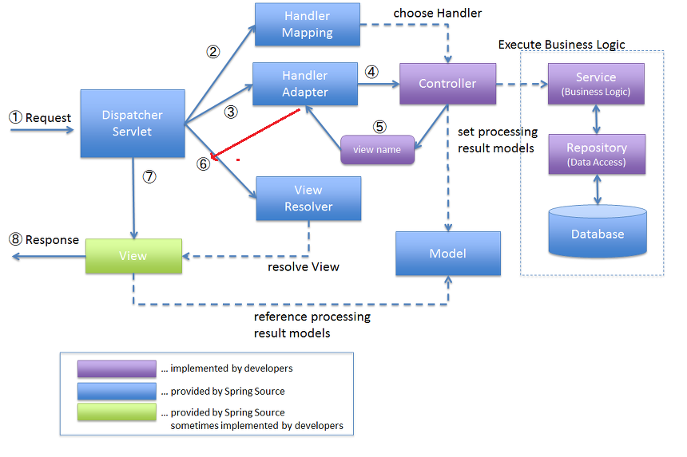

# 1일차 정리

## 1. cmder 다운로드 및 설치
- cmder 다운로드 진행
-  C:\dev\cmder 압축풀기

## Git & GitHub 설치 및 연동
- Git 다운로드 및 설치
- 환경변수 추가 확인
- GitHub 레파지토리 생성 : sch-2025
-토큰 발행

## Git 명령어
- 사용자 확인 및 설정 : git config --global user.name "사용자이름"
- 이메일 확인 및 설정 : git config --global user.email "GitHub  로그인 이메일주소"
-Stage > git add "파일명 또는 전체(.)"
- Local Repository >add :    git commit -m "commit 메세지~"  //작업 날짜 및 시간, 작업명, 작업자 이메일...
- GitHub Remote Repository push : git push origin main

## 4. JDK 다운로드 및 설치
- JDK 17이상 설치 : 스프링부트 사용시
- 기본 폴더에 설치 > java -version

## 5. Imtellj 다운로드 및 설치
- 30일 무료 버전 : 커뮤티니 버전 설치

## 6. 스프링부트 프로젝트 생성 및 실행
- start.spring 사이트에서 springboot 프로젝트 생서
- intrllj > open > 프로젝트 임포트
- 실행 : 프로젝트 > src > main > java > SpringbootApplication 클래스의 main 메소드 실행 : 녹색버튼

## 7. 스프링 구조 : mvc 패턴
