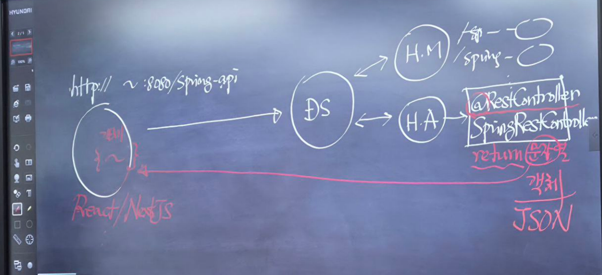

# 2일차

## 1. 정적 컨텐츠 : html, image emd
- 프로젝트\src\resource\static\정적컨텐츠 저장 (public 도 사용가능)
- 스프링부트에서 실행하지 않고, 브라우저에 전달


## 2. View : 템플릿엔진(Thymleaf), 서블릿, JSP 파일 등
- 요청 시 스프링 부트의 실행 순서에 따라 호출
- D.S (디스패처 서블릿) <--> 핸들러 매핑 <-->  핸들러 어댑터(<--VIew 네임 리턴받고 D.S 전달)  <--> 컨트롤러 매핑 메소드 실행결과<-->  뷰 리졸버    <--> 뷰 리턴
- 뷰를 실행한 결과를 브라우저에 반환 


## 실습
- 브라우저 :http://localhost:8080/spring   
- /spring 컨텍스트 패스를 --> SpringController.java
- pringController.java 실행 결과 --> 'Hello~ Spring!!'


## @RequestParam 객체를 통해 데이터 전송 -> Member 객체생성
- MemberController.java
```
package com.sch.springboot.controller;


import com.sch.springboot.dto.Member;
import org.springframework.stereotype.Controller;
import org.springframework.ui.Model;
import org.springframework.web.bind.annotation.GetMapping;
import org.springframework.web.bind.annotation.RequestParam;

@Controller
public class MemberController {

    @GetMapping("/member")
    public String spring(@RequestParam("name") String name,
                         @RequestParam("age") int age,
                         @RequestParam("address") String address,
                         Model model) { //파라메터를 받는 매개변수 자리
        System.out.println(name); // 서버콘솔에 출력
        System.out.println(age);
        System.out.println(address);

        Member member = new Member();
        member.setName(name);
        member.setAge(age);
        member.setAddress(address);

        model.addAttribute("member", member);


        return  "member"; //View name
    }
}
```

## 파라미터로 전송된 데이터를 @ModelAttribute 를 통해 Member 클레스의  객체 매핑
- Member.java
```
package com.sch.springboot.dto;

public class Member {
    //필드
    private  String name;
    private  int age;
    private  String address;
    private  String subject;

    public String getSubject() {
        return subject;
    }

    public void setSubject(String subject) {
        this.subject = subject;
    }

    //생성자
    public Member(){}
    //매소드


    public void setName(String name) {
        this.name = name;
    }

    public String getName() {
        return name;
    }

    public int getAge() {
        return age;
    }

    public void setAge(int age) {
        this.age = age;
    }

    public String getAddress() {
        return address;
    }

    public void setAddress(String address) {
        this.address = address;
    }
}

```

- MemberController.java
```
package com.sch.springboot.controller;


import com.sch.springboot.dto.Member;
import org.springframework.stereotype.Controller;
import org.springframework.ui.Model;
import org.springframework.web.bind.annotation.GetMapping;
import org.springframework.web.bind.annotation.ModelAttribute;
import org.springframework.web.bind.annotation.RequestParam;

@Controller
public class MemberController {

    @GetMapping("/member")
    public String spring( ℹ️@ModelAttribute Member member,  //form.html 이름과 Member 겟터 셋터 멤버변수 이름이 모두 같아야함 
                         Model model) { //파라메터를 받는 매개변수 자리

        model.addAttribute("member", member);


        return  "member"; //View name
    }
}

```


## @ResponseBody 를 사용하여 문자열 바로 넘기기
- @RequestParam 이용
```
@ResponseBody
@Controller
public class SpringController {

    @ResponseBody  //View를 거치지 않고 문자혈 형태로 바로 전송
    @GetMapping("/spring-api")
    public String springApi(@RequestParam("name") String name, @RequestParam("age") String age,
                            Model model) {

        model.addAttribute("name", name);
        model.addAttribute("age", age);
        return model.toString();
    }
}
```

- @ModelAttribute 이용
```
public class SpringController {

    @ResponseBody  //View를 거치지 않고 문자혈 형태로 바로 전송
    @GetMapping("/spring-api")
    public String springApi( ℹ️@ModelAttribute Member member) {

        return member.toString();
    }
}
```

## @RestController 이용 REST API를 만들기 위한 컨트롤러 전용 애너테이션 

- 문자열 형식
```

 ℹ️@RestController
public class SpringRestController {
    @GetMapping("/spring-api")
    public String springApi() {

        return "RestController Spring API";
    }
}

```

- 객체 전송시 JSON 전송
```
@RestController
public class SpringRestController {
    @GetMapping("/spring-api")
    public ℹ️Member springApi() {
        Member member = new Member();

        member.setName("홍길동");
        member.setAge(30);
        member.setAddress("춘천시");
        member.setSubject("스프링 부트");

        return ℹ️member;
    }
}
```

- @Controller 이용시 @ResponseBody 이용한 객체(JSON) 반환 ---> @RestController 와 같은 효과
```
ℹ️@Controller
public class MemberController {

    @GetMapping("/member")
    public String member(....){}
    


    @PostMapping("/member")
    public String submit(....) {}

      

    ℹ️@ResponseBody //사용 자제~
    @PostMapping("/member-api")
    public Member submit(@ModelAttribute Member member) {
        return member;
    }
}
```
- Html
```
<form action="/member-api" method="post">
    <ul>
        <li>
            <label>Name</label>
            <input type="text" name="name">
        </li>     
        <li>
            <button type="submit">Send</button>
            <button type="reset">Cancle</button>
        </li>
    </ul>
</form>
```

