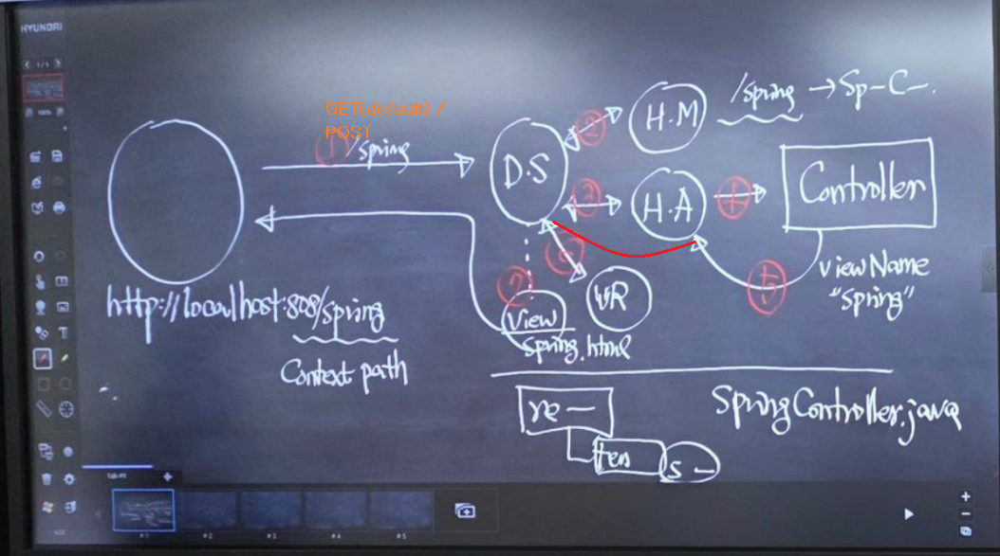
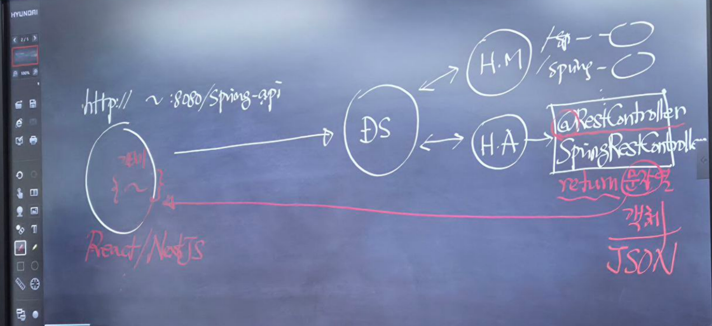

요청한 내용을 깔끔한 Markdown 문서로 재구성했다. 이미지 경로는 제공된 것처럼 존재한다고 가정하여 포함했다.[1]

# 2일차

## 1. 정적 컨텐츠: HTML, 이미지 등
- 정적 리소스는 src/main/resources/static 또는 public 폴더에 두면 요청 경로와 동일하게 그대로 응답된다.[1]
- 컨트롤러 로직을 거치지 않고 웹 서버가 파일을 바로 브라우저로 전달한다.[1]

## 2. View: 템플릿 엔진(Thymeleaf), 서블릿, JSP
- 요청은 스프링 MVC 표준 흐름으로 처리된다.[1]
- DispatcherServlet ↔ HandlerMapping ↔ HandlerAdapter(컨트롤러 실행) ↔ ViewResolver ↔ View(Render) 순으로 동작한다.[1]
- 렌더링 결과(HTML)가 브라우저로 반환된다.[1]



## 실습
- 브라우저: http://localhost:8080/spring 로 접속한다.[1]
- /spring 경로는 SpringController.java에 매핑된다.[1]
- 컨트롤러 실행 결과는 'Hello~ Spring!!'을 출력한다.[1]

## @RequestParam으로 파라미터 바인딩 → Member 객체 생성
- MemberController.java 예시 코드.[1]

```java
package com.sch.springboot.controller;

import com.sch.springboot.dto.Member;
import org.springframework.stereotype.Controller;
import org.springframework.ui.Model;
import org.springframework.web.bind.annotation.GetMapping;
import org.springframework.web.bind.annotation.RequestParam;

@Controller
public class MemberController {

    @GetMapping("/member")
    public String spring(@RequestParam("name") String name,
                         @RequestParam("age") int age,
                         @RequestParam("address") String address,
                         Model model) {
        System.out.println(name);
        System.out.println(age);
        System.out.println(address);

        Member member = new Member();
        member.setName(name);
        member.setAge(age);
        member.setAddress(address);

        model.addAttribute("member", member);
        return "member"; // View name
    }
}
```


## @ModelAttribute로 폼 데이터 자동 매핑
- Member.java.[1]

```java
package com.sch.springboot.dto;

public class Member {
    // 필드
    private String name;
    private int age;
    private String address;
    private String subject;

    // 생성자
    public Member() {}

    // 게터/세터
    public String getSubject() { return subject; }
    public void setSubject(String subject) { this.subject = subject; }

    public void setName(String name) { this.name = name; }
    public String getName() { return name; }

    public int getAge() { return age; }
    public void setAge(int age) { this.age = age; }

    public String getAddress() { return address; }
    public void setAddress(String address) { this.address = address; }
}
```


- MemberController.java.[1]

```java
package com.sch.springboot.controller;

import com.sch.springboot.dto.Member;
import org.springframework.stereotype.Controller;
import org.springframework.ui.Model;
import org.springframework.web.bind.annotation.GetMapping;
import org.springframework.web.bind.annotation.ModelAttribute;

@Controller
public class MemberController {

    @GetMapping("/member")
    public String spring(@ModelAttribute Member member, Model model) {
        model.addAttribute("member", member);
        return "member"; // View name
    }
}
```


> 주의: 폼 필드 이름과 Member의 프로퍼티(게터/세터) 이름이 동일해야 올바르게 매핑된다.[1]

## @ResponseBody로 문자열 바로 반환
- @RequestParam 사용하는 경우.[1]

```java
import org.springframework.stereotype.Controller;
import org.springframework.ui.Model;
import org.springframework.web.bind.annotation.GetMapping;
import org.springframework.web.bind.annotation.RequestParam;
import org.springframework.web.bind.annotation.ResponseBody;

@ResponseBody
@Controller
public class SpringController {

    @ResponseBody  // View를 거치지 않고 본문에 바로 기록
    @GetMapping("/spring-api")
    public String springApi(@RequestParam("name") String name,
                            @RequestParam("age") String age,
                            Model model) {
        model.addAttribute("name", name);
        model.addAttribute("age", age);
        return model.toString();
    }
}
```


- @ModelAttribute 사용하는 경우.[1]

```java
import org.springframework.web.bind.annotation.GetMapping;
import org.springframework.web.bind.annotation.ModelAttribute;
import org.springframework.web.bind.annotation.ResponseBody;

public class SpringController {

    @ResponseBody  // View를 거치지 않고 본문에 바로 기록
    @GetMapping("/spring-api")
    public String springApi(@ModelAttribute Member member) {
        return member.toString();
    }
}
```


## @RestController로 REST API 작성
- 문자열 반환.[1]

```java
import org.springframework.web.bind.annotation.GetMapping;
import org.springframework.web.bind.annotation.RestController;

@RestController
public class SpringRestController {

    @GetMapping("/spring-api")
    public String springApi() {
        return "RestController Spring API";
    }
}
```


- 객체 반환 시 JSON 직렬화.[1]

```java
import org.springframework.web.bind.annotation.GetMapping;
import org.springframework.web.bind.annotation.RestController;

@RestController
public class SpringRestController {

    @GetMapping("/spring-api")
    public Member springApi() {
        Member member = new Member();
        member.setName("홍길동");
        member.setAge(30);
        member.setAddress("춘천시");
        member.setSubject("스프링 부트");
        return member; // JSON으로 직렬화되어 응답
    }
}
```


## @Controller에서 JSON 반환(@ResponseBody)
- @Controller + @ResponseBody로 객체를 반환하면 JSON 응답이 된다.[1]

```java
import org.springframework.stereotype.Controller;
import org.springframework.web.bind.annotation.ModelAttribute;
import org.springframework.web.bind.annotation.PostMapping;
import org.springframework.web.bind.annotation.ResponseBody;

@Controller
public class MemberController {

    @ResponseBody
    @PostMapping("/member-api")
    public Member submit(@ModelAttribute Member member) {
        return member; // JSON 응답
    }
}
```


- HTML 예시.[1]

```html
<form action="/member-api" method="post">
  <ul>
    <li>
      <label>Name</label>
      <input type="text" name="name">
    </li>
    <li>
      <button type="submit">Send</button>
      <button type="reset">Cancel</button>
    </li>
  </ul>
</form>
```





## 로그인, 회원가입, - DTO, Controller, Service, Repository

-- Controller

```java
import org.springframework.web.bind.annotation.PostMapping;
import org.springframework.web.bind.annotation.ResponseBody;

import java.util.Map;

@Controller
public class UserController {

    UserService userService = new UserService();

    @ResponseBody
    @PostMapping("/login")
    public Map<String, Object> login(User user){

        return userService.login(user);  //Map<String, Object>
    }


    @ResponseBody
    @PostMapping("/signup")
    public Map<String, String> signup(User user){

        return userService.signUp(user);
    }
}

```

-- Service

```java
package com.sch.springboot.service;

import com.sch.springboot.dto.User;
import com.sch.springboot.repository.UserRepository;
import org.springframework.stereotype.Service;

import java.util.Map;

@Service
public class UserService {

    UserRepository userRepository = new UserRepository();

    /**
     * login : 로그인 비즈니스 로직 처리
     */
    public Map<String, Object> login(User user) {
        System.out.println("UserService login ---> ");
        System.out.println(user.getId() + "," + user.getPass());
        return userRepository.login(user);  //Map<String, Object>
    }

    /**
     * signUp : 회원가입 비즈니스 로직 처리
     */
    public Map<String, String> signUp(User user) {

        return userRepository.signUp(user);
    }
}
,,,

-- Repository


```java
package com.sch.springboot.repository;

import com.sch.springboot.dto.User;
import org.springframework.stereotype.Repository;

import java.util.HashMap;
import java.util.Map;

@Repository
public class UserRepository {
    /**
     * signUp : 회원가입 처리
     */
    public Map<String, String> signUp(User user) {
        Map<String, String> result = new HashMap<>();

        result.put("id", user.getId());
        result.put("pass", user.getPass());
        result.put("name", user.getName());
        result.put("email", user.getEmail());

        return result;
    }


    /**
     * login : 로그인 처리
     */
    public Map<String, Object> login(User user) {
        String did = "test";
        String dpass = "1234";
        Map<String, Object> result = new HashMap<String, Object>();

        if(user.getId().equals(did) && user.getPass().equals(dpass)){
            //로그인 성공
            result.put("status", "success");
            result.put("message", "로그인 성공!");
            result.put("id", user.getId());
        } else {
            //로그인 실패
            result.put("status", "fail");
            result.put("message", "로그인 실패!");
            result.put("id", user.getId());
        }
        return result;
    }

}
```


## 체크리스트
- 정적 리소스가 static 또는 public 아래에 있는지 확인한다.[1]
- 경로 매핑(/spring, /member, /spring-api)이 의도대로 동작하는지 확인한다.[1]
- @RequestParam과 @ModelAttribute 매핑이 Member 필드에 올바르게 반영되는지 검증한다.[1]

## 학습 포인트
- 정적 리소스는 MVC 컨트롤러를 거치지 않는다.[1]
- MVC 요청 흐름은 DispatcherServlet을 중심으로 표준 파이프라인을 따른다.[1]
- REST API는 @RestController 또는 @ResponseBody로 본문에 JSON을 직접 쓴다.[1]

[1](https://ppl-ai-file-upload.s3.amazonaws.com/web/direct-files/attachments/33201083/1646714b-8f82-4e41-8a4b-24dc4f8419c5/2ilca.md)